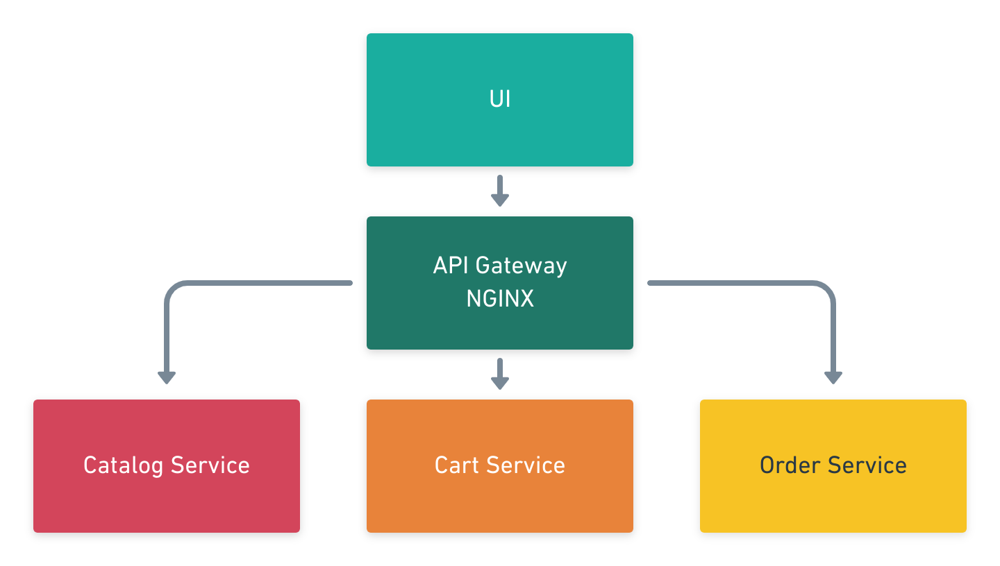

[Marble.js 3.0 landed](https://medium.com/@jflakus/announcing-marble-js-3-0-a-marbellous-evolution-ba9cdc91d591) with a brand new module **[@marble/messaging](https://docs.marblejs.com/messaging/microservices)** for building event-based microservices architecture in a robust and unified way.

Martin Fowler defines the therm "Microservice Architecture" as a particular way of designing software applications as suites of independently deployable services.

### e-commerce sample application

Let's implement an e-commerce microservices architecture with Marble.js.

All requests from clients first go through the API Gateway. It then routes requests to the appropriate microservice.



A distributed system must use an inter-process communication mechanism. The best option is to use an asynchronous messaging-based mechanism also called message brokers such as [RabbitMQ (AMQP)](https://www.rabbitmq.com/).

#### Available operations

The application will support the following operations REST operations :

| Microservice | Method | URI            | Description              |
| ------------ | ------ | -------------- | ------------------------ |
| Catalog      | `GET`  | `/products`    | Get a list of products.  |
| Cart         | `POST` | `/carts`       | Creates a cart.          |
| Cart         | `GET`  | `/carts/{id}`  | Get cart by id.          |
| Order        | `POST` | `/orders`      | Creates an order.        |
| Order        | `GET`  | `/orders/{id}` | Get order details by id. |

#### Domain events

The application will emit the following domain events :

| Event                   | Publisher | Consumer |
| ----------------------- | --------- | -------- |
| `product-added-to-cart` | Catalog   | Cart     |
| `cart-validated`        | Cart      | Order    |
| `cart-expired`          | Cart      | Order    |

Now let's create the catalog microservice using Marble.js :

```ts
import {
  createMicroservice,
  messagingListener,
  Transport,
} from '@marblejs/messaging';
import { IO } from 'fp-ts/lib/IO';
import { getProducts$, getProduct$ } from './consumer.effect';

const listener = messagingListener({
  effects: [getProducts$, getProduct$],
});

const microservice = createMicroservice({
  transport: Transport.AMQP,
  options: {
    host: 'amqp://localhost:5672',
    queue: 'app_queue',
  },
  listener,
});

const main: IO<void> = async () => await (await microservice)();

main();
```

Marble.js offers an abstraction over the transport layer that lets you choose between [AMQP (RabbitMQ)]() and [Redis Pub/Sub]().

```ts
import { act, matchEvent } from '@marblejs/core';
import { MsgEffect } '@marblejs/messaging';
import { of } from 'rxjs';

export const hello$: MsgEffect = (event$, ctx) =>
  event$.pipe(
    matchEvent('HELLO'),
    act(event =>
      of(reply(event)({
        type: event.type,
        payload: `Hello, ${event.payload}!`,
      })
    ),
  );
```
