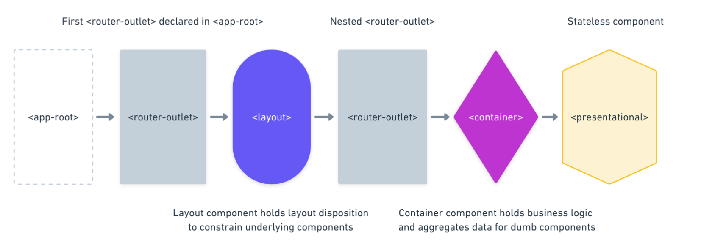

When building JavaScript applications we usually separate components in different layers, each one responsible of its own concern. You've certainly heard about presentational components, container components, or the less well known, layout components?

> Let me try to explain, what is a layout component in Angular, and how to build modular applications using this technique.

Layout components are used to hold common layout composition. This design enables to reuse layouts across different parts of your application. It will also simplify underlying components and enforce the single responsibility principle.

## The view layer architecture

The schema below illustrates the component tree using a layout component. Layout components are realizable using the nested `<router-outlet>` technique.



Now let's see what does it looks like in code. Here is the root component that instantiates the first `<router-outlet>`.

```ts
import { Component } from '@angular/core';

@Component({
  selector: 'app-root',
  template: `
    <router-outlet></router-outlet>
  `,
})
export class AppComponent {}
```

Then we need to declare top level routes. Note that lazy loading is used to improve initial load performance.

```ts
import { Route } from '@angular/router';

export const APP_ROUTES: Route[] = [
  {
    path: '',
    redirectTo: '/dashboard',
    pathMatch: 'full',
  },
  {
    path: 'dashboard',
    loadChildren: () =>
      import('./dashboard/dashboard.module').then(m => m.DashboardModule),
  },

  /* No layout routes */
  { path: 'login', component: LoginComponent },
  { path: 'register', component: RegisterComponent },

  /* Not found redirection */
  { path: '**', redirectTo: '' },
];
```

At this point we have to bring this together in the `AppModule`.

```ts
import { NgModule } from '@angular/core';
import { BrowserModule } from '@angular/platform-browser';
import { RouterModule } from '@angular/router';

import { APP_ROUTES } from './routes';
import { AppComponent } from './app.component.ts';

@NgModule({
  imports: [BrowserModule, RouterModule.forRoot(APP_ROUTES)],
  bootstrap: [AppComponent],
})
export class AppModule {}
```

The next step is to create the layout component. Consider this simple scenario.

```ts
import { Component } from '@angular/core';

@Component({
  selector: 'app-main-layout',
  template: `
    <ng-container>
      <app-navbar></app-navbar>
      <router-outlet></router-outlet>
      <app-footer></app-footer>
    </ng-container>
  `,
})
export class MainLayoutComponent {}
```

The nested `<router-outlet>` is declared in the `MainLayoutComponent`. The router will pass-through this layout component to resolve the child component.

```ts
import { Route } from '@angular/router';

import { DashboardComponent } from './dashboard.component';
import { MainLayoutComponent } from './main-layout.component';

export const DASHBOARD_ROUTES: Route[] = [
  {
    path: '',
    component: MainLayoutComponent,
    children: [
      {
        path: '',
        component: DashboardComponent,
      },
    ],
  },
];
```

The piece of code above stick all together, layout and container are combined in a declarative way using the routes tree. Imagine we want to swap the `MainLayoutComponent` with an other layout, we can easily achieve this without refactoring the `DashboardComponent` template, which is pretty cool.

Note that using this technique, the router re-creates layout components only when the user navigates between routes from different layouts.

## Resources

Here is an interacting example created by [Josip Bojčić](https://github.com/jbojcic1).

<iframe
  src="https://layout-components.stackblitz.io"
  class="iframe"
  title="Layout components"
></iframe>

There is [an other approach](https://stackblitz.com/github/jbojcic1/angular-routing-example/tree/routing-reuse-layout-example-3-with-subscribing-to-route-events) using router events. This approach doesn't come with a nested `<router-outlet>` in a dedicated layout component, but I prefer the layout component way because it feels less hacky and more robust.
