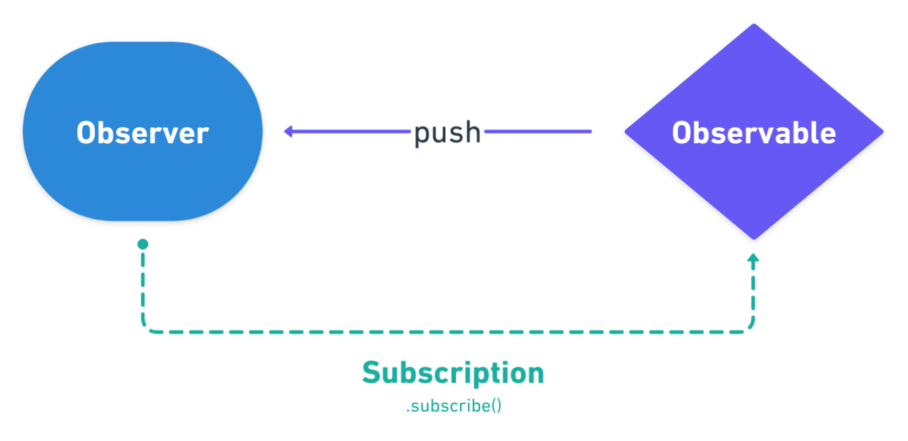

Observables are everywhere in Angular and a lot of stuff operates using them. In fact they are used to know **when** and **what** to do.

Before starting let's define the Subscription.

A Subscription is an object that represents the connection between an Observable and an Observer. This object holds the Observable execution. Observables are lazy (vs eager like Promises), which means that they don't push any value before the system `.subscribe()` to them.



As we usually do with `.addEventListener(...)` or `setInterval(...)`, the Observable execution needs to be stopped somehow to avoid memory leaks.

> A Subscription has one important method, unsubscribe, that takes no argument and just disposes the resource held by the subscription.


We usually think that memory leaks are hidden and imperceptible. It's totally false, an application that has memory leaks becomes quickly unusable before it entirely crashes.

It directly affects final users and results in a poor experience. Nobody will reuse your buggy application so don't mess with subscriptions.

## Concretely in Angular

There are many ways to manage Subscriptions in Angular. The following example uses a `BookService` which exposes a long-lived Observable `availableBooks$` that emits a book list in real time.

Next to this we want to display the list in a component and automatically update the view whenever the list changed.

#### Common pitfall

Let's start by the bad way, this implementation has a memory leak, the subscription is not managed.

```ts
@Component({
  selector: 'book-list',
  template: `
    <ul class="list" *ngIf="books">
      <li *ngFor="let book of books; trackBy: trackById">
        <strong>{{ book.title }}</strong>
      </li>
    </ul>
  `,
})
export class BookListComponent implements OnInit {
  books: Book[];

  constructor(private bookService: BookService) {}

  ngOnInit(): void {
    this.bookService.availableBooks$.subscribe(list => {
      this.books = list;
    });
  }

  trackById(index: number, book: Book): string {
    return book.id;
  }
}
```

When this component is destroyed the Observable keeps running forever, consuming more resources each time the component is recreated.

#### Referenced Subscription

Here is the common memory safe approach using a Subscription reference.

```ts
@Component({
  selector: 'book-list',
  template: `
    <ul class="list" *ngIf="books">
      <li *ngFor="let book of books; trackBy: trackById">
        <strong>{{ book.title }}</strong>
      </li>
    </ul>
  `,
})
export class BookListComponent implements OnInit, OnDestroy {
  private _subscription: Subscription;

  books: Book[];

  constructor(private bookService: BookService) {}

  ngOnInit(): void {
    this._subscription = this.bookService.availableBooks$.subscribe(books => {
      this.books = books;
    });
  }

  ngOnDestroy(): void {
    this._subscription.unsubscribe();
  }

  trackById(index: number, book: Book): string {
    return book.id;
  }
}
```

The Subscription is managed manually and requires extra work from the developer. The implementation looses its reactivity in favor of imperative programming with side-effects which is exactly what we want to avoid.

#### Subject + takeUntil way

An other approach is to use a Subject to notify whenever the component is destroyed in combination with `takeUntil` operator to cleanup the Observable execution.

```ts
@Component({
  selector: 'book-list',
  template: `
    <ul class="list" *ngIf="books">
      <li *ngFor="let book of books; trackBy: trackById">
        <strong>{{ book.title }}</strong>
      </li>
    </ul>
  `,
})
export class BookListComponent implements OnInit, OnDestroy {
  private _destroy$ = new Subject<void>();

  books: Book[];

  constructor(private bookService: BookService) {}

  ngOnInit(): void {
    this.bookService.availableBooks$
      .pipe(
        tap(books => {
          this.books = books;
        }),
        takeUntil(this._destroy$)
      )
      .subscribe();
  }

  ngOnDestroy(): void {
    this._destroy$.next();
  }

  trackById(index: number, book: Book): string {
    return book.id;
  }
}
```

This implementation still looks bad because some extra logic needs to be added to cleanup the Observable execution.

> Note that no need to call `this._destroy$.complete()` when destroyed because the Subject with no subscriber is just a function.

#### Async pipe way

Angular natively comes with the powerful `async` pipe to manage view Subscriptions effortlessly.

```ts
@Component({
  selector: 'book-list',
  template: `
    <ul class="list">
      <li *ngFor="let book of books$ | async; trackBy: trackById">
        <strong>{{ book.title }}</strong>
      </li>
    </ul>
  `,
})
export class BookListComponent {
  books$: Observable<Book[]> = this.bookService.availableBooks$;

  constructor(private bookService: BookService) {}

  trackById(index: number, book: Book): string {
    return book.id;
  }
}
```

This approach removes a lot of code and looks significantly better.

- no additional checks in the template.
- no additional component property.
- automated un-subscription handled by the pipe.

#### Decorator way

```ts
```
