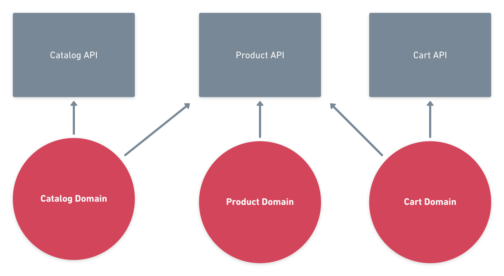

> Disclaimer : this post is opinionated since everyone fails to clearly defines the only way to implement DDD. Sometimes it's all about perspective.

Some years ago I worked for the first time with Domain-Driven Design on back-end applications. I painfully discovered that managing DDD architecture requires tools and shared knowledge between team members.

DDD is now coming in the client-side JavaScript world, and I recently started to work on project built with it, here are my thoughts.

## Shared knowledge

That's the first point to any technological choices and especially with DDD, the knowledge should be shared between all team members.


Everyone should understand and adhere to the architectural contours of the decided stack. In some case it's better to opt for a simpler architecture.

## Required toolbox

Since DDD is about keeping a maintainable architecture at scale, the following tools are mandatory to achieve this :

#### Nx Monorepos

[Nx monorepos](https://nx.dev) is used to organize and manage the whole project in many libraries and applications.

#### CI pipeline

The CI pipeline will help you to automatically build, test and deploy each part of your mono-repository.

## Front-end complexity

Building JavaScript user-interface is a complex problem nowadays, client-side code should handle many things like :

- Defining data
- Organizing UI
- Managing client and server state
- Handling data-flow

Here patterns like NgRx or Observables can help doing this, but we can also take some ideas from DDD to keep our application more sustainable.

## Code organization

One of the first idea of DDD is to separate our code in domain models. A domain is a logical piece in your software that reflect a reality. An order, a cart, a product are common domains examples.

The main goal behind this is to separate business concerns and keep our domains tightly coupled between each others.


The schema above represent the architecture. The bottom line is the core library that holds all the domain logic including data-access, state management and core components.

### Simple core

From my point of view it's better to stick domain, infrastructure and application layers together into a single library. It makes testing less complex and drastically reduce the boilerplate.

Most of the challenges are in a good domain definition. Trying to make domain agnostic from data-access or state management is a waste of time.

### Types of libraries

| Type    | Description                                                                                                                                                     | Example                            |
| ------- | --------------------------------------------------------------------------------------------------------------------------------------------------------------- | ---------------------------------- |
| Core    | The core library holds all the domain code from the application layer to infrastructure layer. It contains components, services and state management.           | `ProductRepository`, `Product`     |
| API     | The API exposes domain code to others domains. It's the contract with the outside world, changing something here may have repercussions into several libraries. | `ProductModule`                    |
| Feature | A feature module is imported by the final app to prevent directly using core domain implementation details. Generally it's a routed component.                  | `<catalog-page>`, `<product-page>` |
| UI      | A UI library should contain dumb components for a particular domain, it also can be in a shared area like that is required in many places.                      | `<product>`, `<order>`, `<card>`   |

### Access restrictions

For keeping layers tightly coupled we use [access restrictions](https://www.angulararchitects.io/aktuelles/sustainable-angular-architectures-2#check-accesses-to-libraries). These rules protect domains from being involuntary coupled with other domain implementation details.



Of course, we need to add interactions between domains. Obviously a cart has relations with products, but we will use an API between them to establish a clear contract that reflect the use-cases.

## Fine-grained Angular Modules

In addition to libraries I use [Single Component Angular Module](https://medium.com/marmicode/your-angular-module-is-a-scam-b4136ca3917b) (SCAM). It's an architecture where each component lives in a dedicated module. It helps to finely delimit module functionality. SCAM looks like this :

```ts
import { Component, Input, NgModule } from '@angular/core';
import { MatCardModule } from '@angular/material/card';

@Component({
  selector: 'app-product-list',
  template: `
    <mat-card *ngFor="let product of products">
      <mat-card-title>{{ product.title }}</mat-card-title>
      <mat-card-content>{{ product.description }}</mat-card-content>
    </mat-card>
  `,
})
export class ProductListComponent {
  @Input()
  products: Product[] = [];
}

@NgModule({
  declarations: [ProductListComponent],
  exports: [ProductListComponent],
  imports: [MatCardModule],
})
export class ProductListModule {}
```

It also works for pipes and directives. Layers will be much more explicit on what's being imported and exported :

```ts
export { ProductFormModule, ProductListModule, ProductModule };
```

SCAMs are also useful for testing, since they import exactly what's needed for the component test case.
