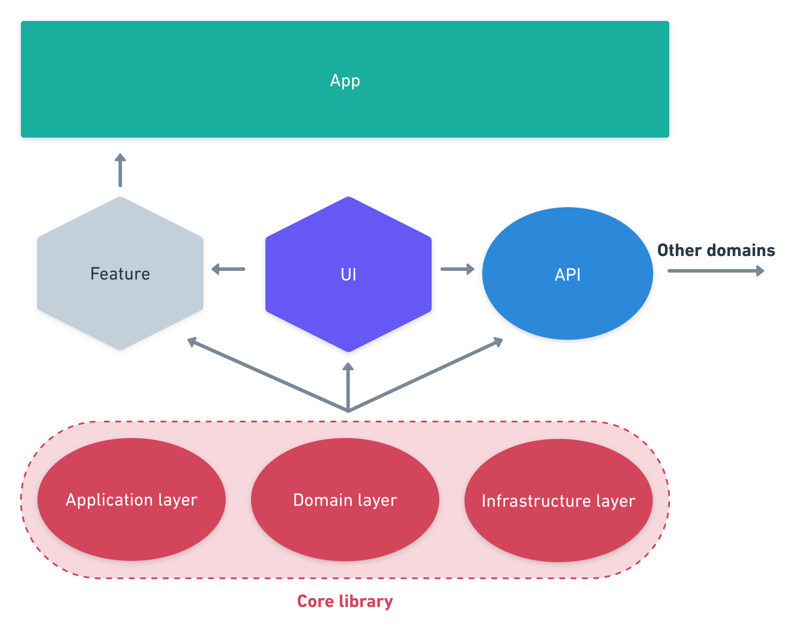

> Disclaimer : this post is opinionated since everyone fails to clearly defines the only way to implement DDD. Sometimes it's all about perspective.

Some years ago I worked for the first time with Domain-Driven Design on back-end applications. We painfully discovered that **managing DDD architecture requires tools and shared knowledge** between team members.

Today DDD is coming in the client-side application world and I recently started to work on project built with it, here are my thoughts.

## Shared knowledge

It's counter productive to choose patterns that don't fit the team needs. That's the first point to any technological choices and especially with DDD, the knowledge should be shared between all team members.


Everyone should understand and adhere to the architectural contours of the decided stack. In some case it's better to opt for a simpler architecture.

## Required toolbox

The first thing that comes in mind with DDD is **domain definition and layers organization**. Here are tools needed in prior to achieve this :

- an [Nx monorepos](https://nx.dev) to organize and manage the whole project
- whatever CI pipeline to build, test and deploy each layer independently

Since DDD is about keeping a maintainable architecture at scale, I strongly discourage you to start modeling your application without these tools configured in your project.

## Front-end complexity

Building JavaScript user-interface is a complex problem nowadays, client-side code should handle many things like :

- Defining data
- Managing back-end and front-end state
- Organizing UI
- Handling data-flow

Here tools like ZoneJS, NgRx and Observables can help doing this. But at scale, it can help to take some ideas from DDD to keep our application more sustainable.

## Code organization

Most of the challenges are in code organization. The main goal is to **keep domains tightly coupled between each others**. This helps a lot to avoid spaghetti code and improve maintainability.

A domain is a logical piece in your software that reflect a reality. An order, a cart, a product are common domains examples.



Note that each block is an **independent library**, expect the bottom line that is a single core library that holds all the domain logic including data-access, state management and core components.

From our point of view it's better to stick domain, infrastructure and application layers together into a single library. It makes testing less complex and drastically reduce the boilerplate.

Most of the challenges are in a good domain definition. Trying to make domain code agnostic from data-access or state management is a waste of time.

### Types of layers

A domain is separated in the following libraries :

| Type    | Description                                                              | Example             |
| ------- | ------------------------------------------------------------------------ | ------------------- |
| API     | Exposed code to other domains.                                           | `ProductModule`     |
| Core    | Domain code including data-access, state management and core components. | `ProductRepository` |
| Feature | A smart component for a particular use-case.                             | `<product-details>` |
| UI      | A set of presentational components.                                      | `<product>`         |

#### Feature

The app must import only features modules. It prevents using core implementation details. Generally it's a routed component.

#### Core

The core library holds all the domain logic from the application to the infrastructure layer. It should only be used by it's related feature or API layer.

### Access restrictions

For keeping layers tightly coupled we use [access restrictions](https://www.angulararchitects.io/aktuelles/sustainable-angular-architectures-2#check-accesses-to-libraries) between layers. These rules protect your domains from being involuntary coupled with something else.


Of course, we need to add interactions between domains. Obviously a cart has relations with products, but we will use an interface between them to establish a clear contract that reflect the use-cases.

The main benefit is that complexity will not grow exponentially over time. The downside is that it starts with a relative complex organization from the beginning. That's why DDD should not be applied blindly.

### Fine-grained Angular Modules

[Single Component Angular Module](https://medium.com/marmicode/your-angular-module-is-a-scam-b4136ca3917b) or SCAM is an architectural style where each component lives in a dedicated module.

```ts
import { Component, Input, NgModule } from '@angular/core';
import { MatCardModule } from '@angular/material/card';

@Component({
  selector: 'app-product-list',
  template: `
    <mat-card *ngFor="let product of products">
      <mat-card-title>{{ product.title }}</mat-card-title>
      <mat-card-content>{{ product.description }}</mat-card-content>
    </mat-card>
  `,
})
export class ProductListComponent {
  @Input()
  products: Product[] = [];
}

@NgModule({
  declarations: [ProductListComponent],
  exports: [ProductListComponent],
  imports: [MatCardModule],
})
export class ProductListModule {}
```

To get rid of managing Angular modules : one component, one module. It also works for pipes and directives.

Libraries will be much more explicit on what's being imported and exported :

```ts
export { ProductFormModule, ProductListModule, ProductModule };
```

SCAMs are also useful for testing since they import exactly what's needed for the component test.
